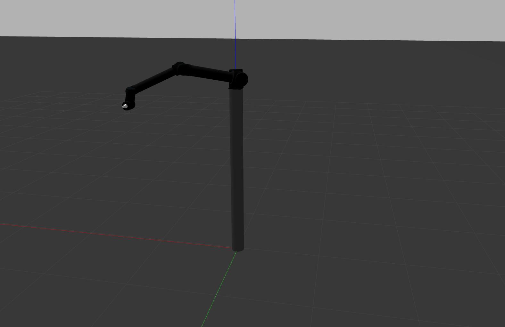
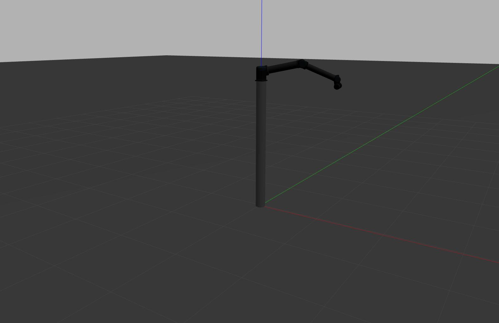
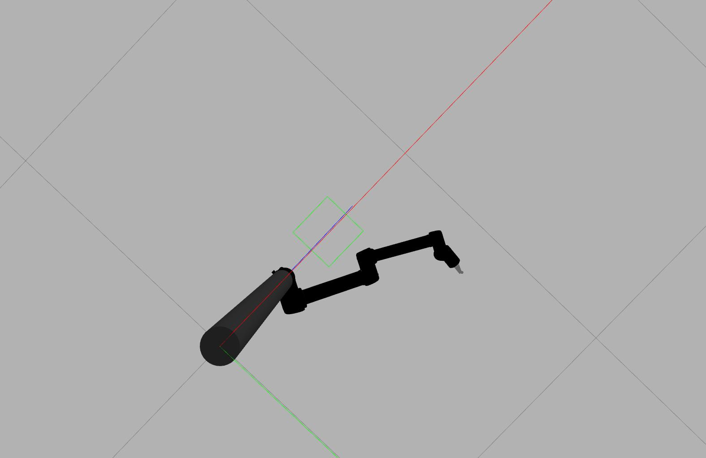
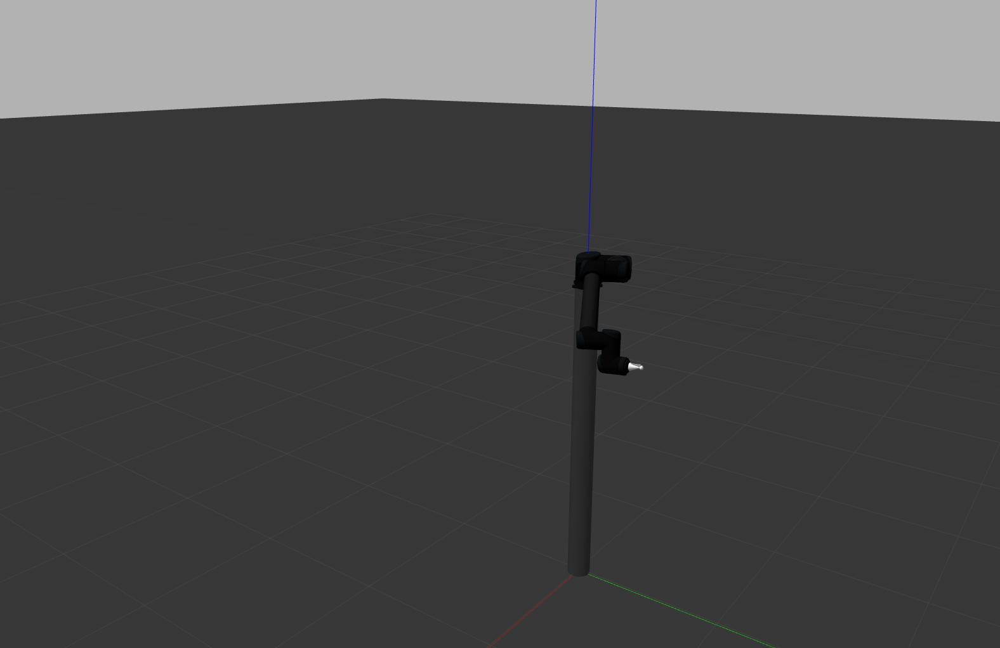
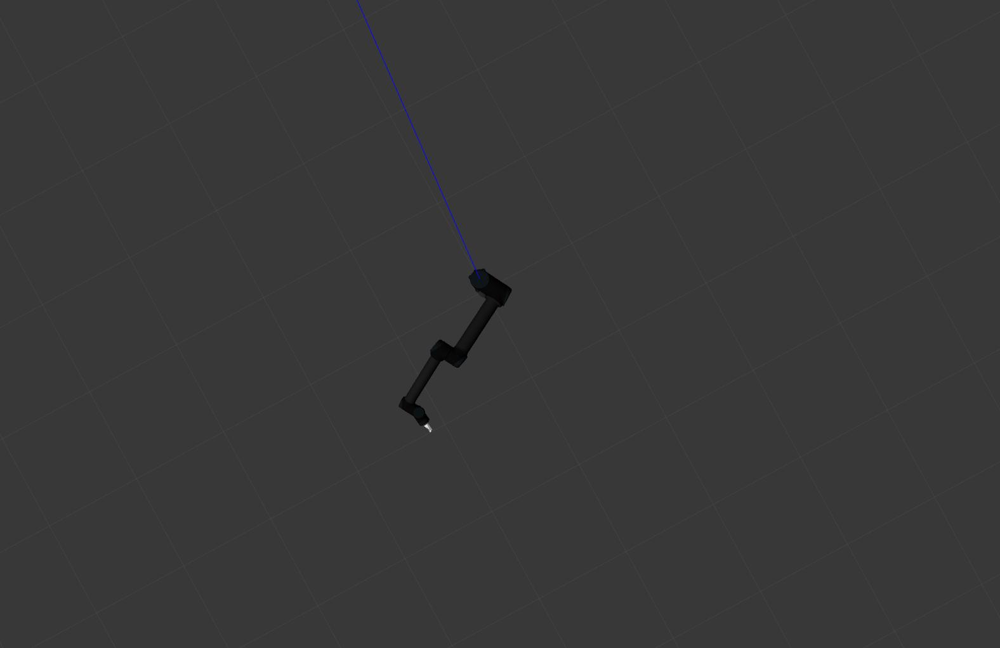
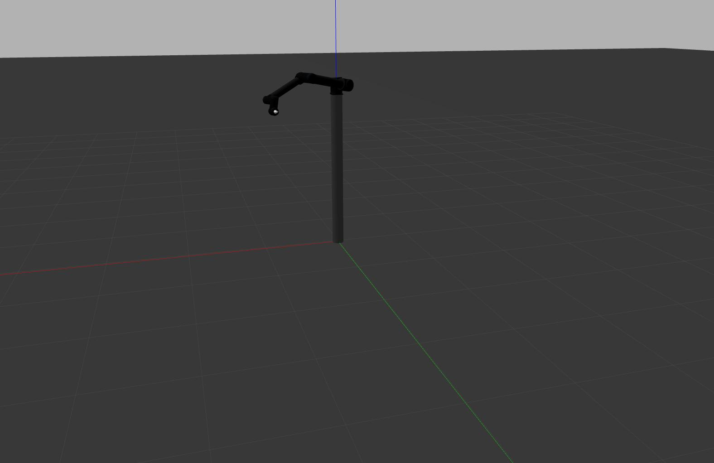

# UR10 Forward Kinematics - HW2 Soru 1

## Proje Açıklaması

Bu ROS paketi, UR10 robot kolunun ileri kinematik hesabını gerçekleştirmek ve simülasyon ortamındaki sonuçlarla karşılaştırmak amacıyla geliştirilmiştir. Açı bilgisi simülasyona gönderilir, simülasyondan alınan uç efektör konumu teorik hesapla karşılaştırılır.

---

## Kurulum

### 1. Gazebo Simülasyon Ortamını Klonlayın

```bash
cd ~/robotlar_ws/src
git clone https://gitlab.com/blm6191_2425b_tai/blm6191/gazebo_plugins_rtg.git
```

### 2. Bağımlılıkları Kurun ve Ortamı Derleyin

```bash
cd ~/robotlar_ws
rosdep install -a
catkin_make
source ~/.bashrc
cp -r src/gazebo_plugins_rtg/models/ur10 ~/.gazebo/models
```

### Compile and Update Environment
After every change, compile the code using the following commands:
```bash
rosnode kill -a   
pkill -9 gzserver
pkill -9 gzclient
pkill -9 roscore
cd ~/robotlar_ws
catkin_make
source ~/.bashrc
```

## Simülasyonu Başlatma

```bash
roslaunch gazebo_plugins_rtg ur10.launch
```

---

## Teorik Kinematik Hesabı

```bash
rosrun ur10_kinematics forward_kinematics
```

Bu komut, tanımlı açı setine göre uç efektörün teorik konumunu (`x, y, z`) hesaplar ve terminale yazdırır.

---

##  Eklemlere açı gönderme
```bash
rostopic pub /ur10_arm/acilar std_msgs/Float32MultiArray "data: [0.5, -0.2, 0.6, -0.6, -0.4, 0.5]"
```

##   Simülasyon pozisyon verisini alma
```bash
rostopic echo /ur10_arm/odometri
```

---

## Simülasyon Hızını Artırma (Opsiyonel)

```bash
gz physics -u 10000
```

---

## Kamera Ayarı

Gazebo'da daha net gözlem yapmak için kamerayı robot koluna göre döndürerek pozisyon ayarlayın.

---

## Simülasyonu Durdurma

```bash
rosnode kill -a
pkill -9 gzserver
pkill -9 gzclient
pkill -9 roscore
```

---


Harika, teorik ve simülasyon sonuçların neredeyse birebir örtüşüyor 🎯 Bu da kinematik modelinin doğru çalıştığını gösteriyor. Şimdi bu verileri senin adına `README.md` dosyasına profesyonelce ekliyorum.

---

## 📄 `README.md`'ye Eklenecek Kısım:

Aşağıdaki bölümü senin dosyana ekle, istersen ben sana dosya halinde de verebilirim.

---

### 📐 Teorik ve Simülasyon Sonuçları Karşılaştırması

Bu bölümde, belirlenen açı değerleri için UR10 robot kolunun uç efektör pozisyonu teorik olarak hesaplanmış ve Gazebo simülasyon çıktıları ile karşılaştırılmıştır.

#### 🔧 Kullanılan Eklemler (Joint Angles):
```
[0.5, -0.2, 0.6, -0.6, -0.4, 0.5]
```

#### 📍 Karşılaştırma Tablosu:

| Pozisyon Tipi         | X         | Y         | Z         |
|------------------------|-----------|-----------|-----------|
| **Teorik Hesap**       | 0.912242  | 0.865278  | 1.925900  |
| **Simülasyon Çıktısı** | 0.912306  | 0.864726  | 1.925880  |

| Oryantasyon Tipi      | X         | Y         | Z         | W         |
|------------------------|-----------|-----------|-----------|-----------|
| **Teorik Hesap**       | 0.0297709 | 0.158760  | 0.0589268 | 0.985107  |
| **Simülasyon Çıktısı** | 0.0297512 | 0.158736  | 0.0589249 | 0.985112  |

####  Değerlendirme:
Pozisyon ve oryantasyon değerleri arasındaki fark milimetre ve onbinde seviyesinde olup, fiziksel simülasyon ortamının toleransları dahilindedir. Bu sonuç, ileri kinematik modellemenin doğruluğunu onaylamaktadır.


## Simülasyon Görselleri

**1. Yandan Görünüm**  


**2. Yandan Görünüm**  


**3. Alttan Görünüm**  


**4. Önden Görünüm**  


**5. Detay Görünüm**  


**6. Detay Görünüm**  



---

## Hazırlayan

Mehmet Taştan  
Yıldız Teknik Üniversitesi – BLM6191 Robotlar Dersi
```
